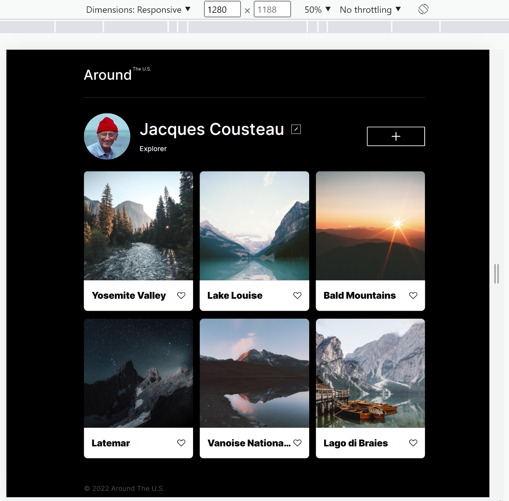
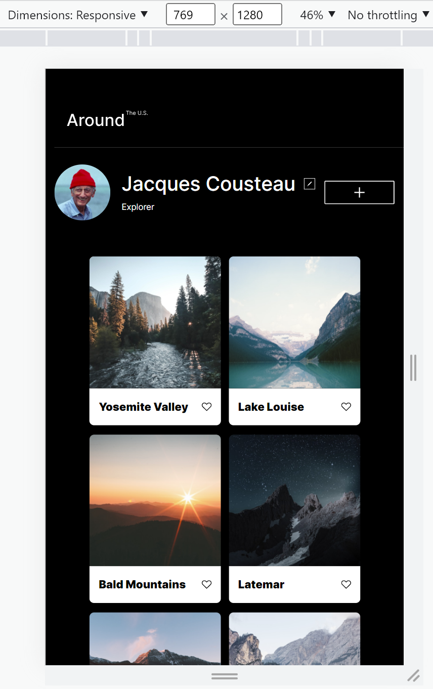
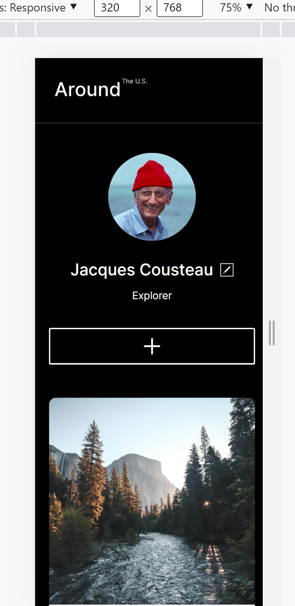

# Project 3: Around The U.S.

### Overview

- Intro
- Figma
- Images
- Githb

**Intro**

This project is made so all the elements are displayed correctly on popular screen sizes. I invested more time in completing this project, since it's more difficult than previous ones.

**Figma**

- [Link to the project on Figma](https://www.figma.com/file/ii4xxsJ0ghevUOcssTlHZv/Sprint-3%3A-Around-the-US?node-id=0%3A1)

**Link to github Project on github pages**

- [Link to the project on Github](https://saumyanaya.github.io/se_project_aroundtheus/index.html)

**Images**
This link contains desktop view.....tablet view......and mobile view

